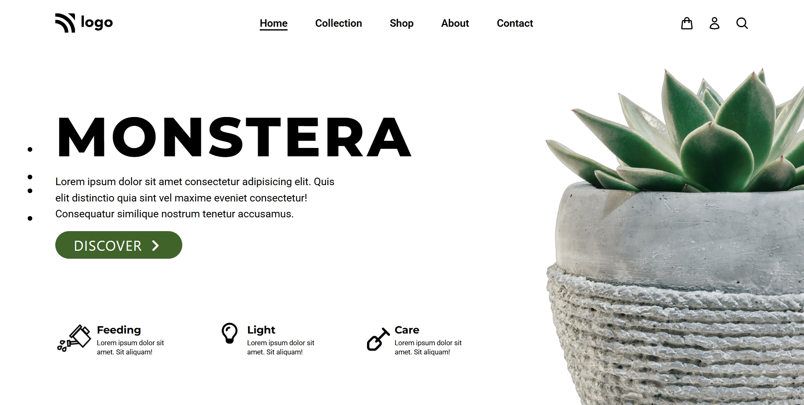
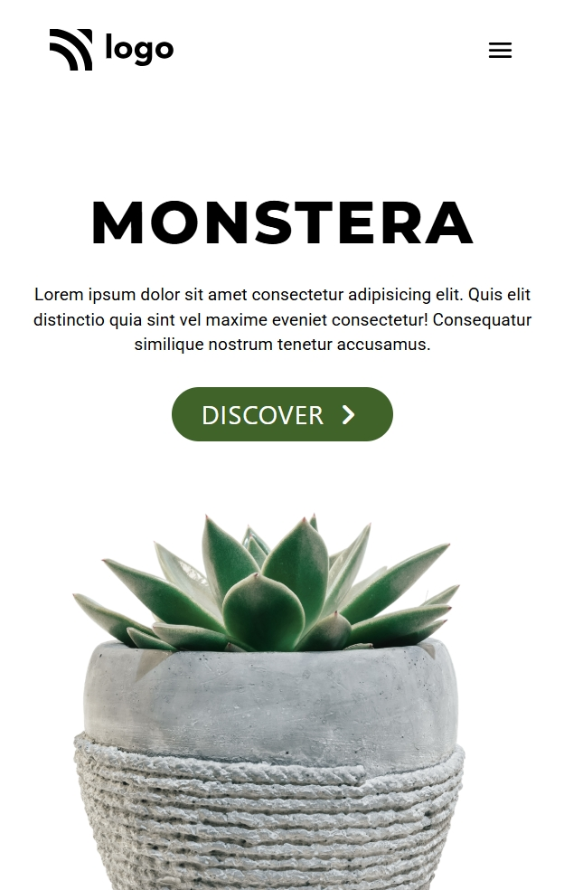
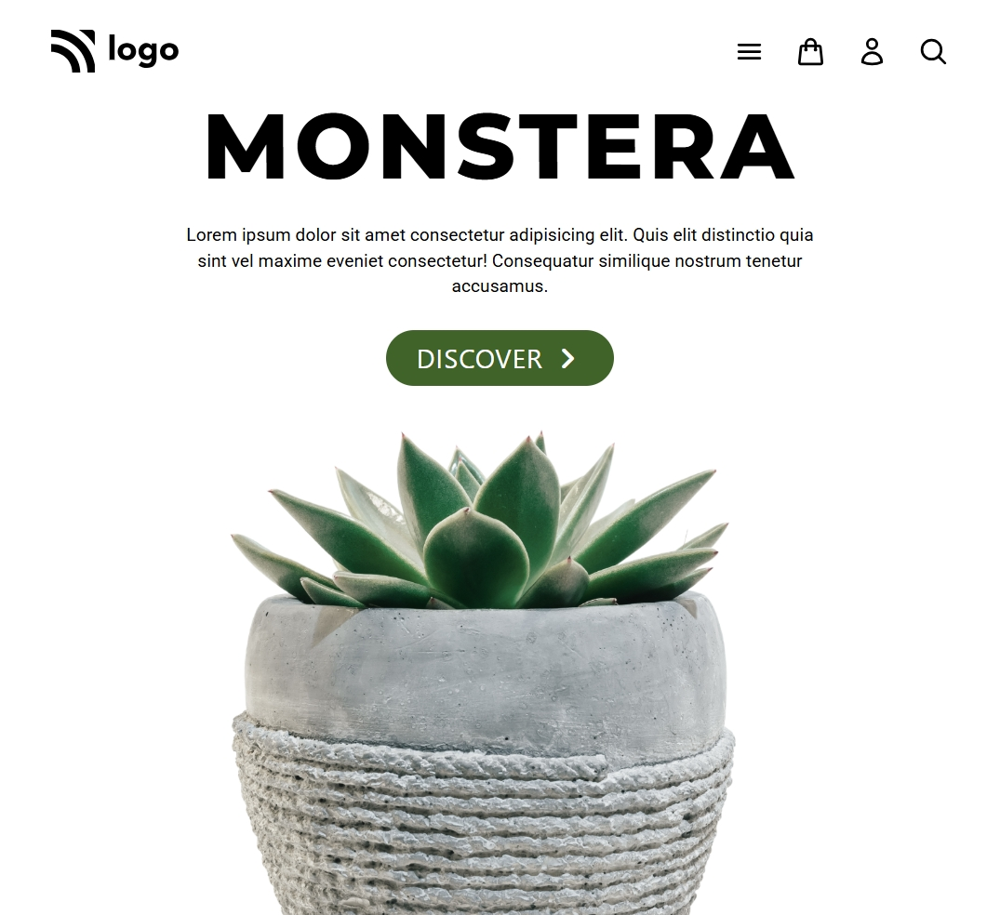
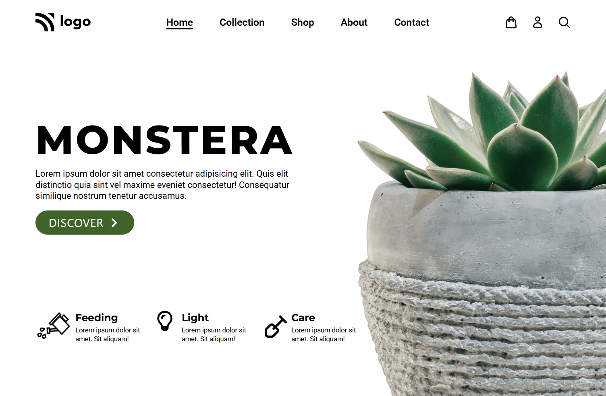

# Plant Home Page


[live](https://z-plant-home-page.netlify.app)

## 📸 Preview

* Desktop view with sidebar navigation and decorative plant image
* Mobile view with centered content and responsive layout






---


# 🌿 Plant Landing Page (Monstera)

A modern, responsive landing page built using **HTML** and **Tailwind CSS**, showcasing a Monstera plant theme. This project focuses on clean UI, responsive design, and minimalistic layout.

---

## 🚀 Features

* 🌱 Responsive design (mobile → desktop)
* 🎨 Styled with Tailwind CSS
* 🔤 Custom fonts using Google Fonts (Montserrat & Roboto)
* ⭐ Icons from Font Awesome
* 📱 Mobile-friendly navigation with hamburger menu
* 🖼️ Decorative images and layout positioning

---


## 🛠️ Tech Stack

* HTML5
* Tailwind CSS (CDN)
* Font Awesome
* Google Fonts

---

## 📂 Project Structure

```
project/
│
├── index.html
├── photos/
│   ├── Logo.svg
│   ├── 6_folwer.png
│   ├── 6_folwer_cut.png
│   ├── springler.png
│   ├── plough.svg
│
└── README.md
```

---

## ⚙️ Setup & Usage

1. Clone the repository:

```
git clone https://github.com/your-username/plant-landing-page.git
```

2. Open the project folder:

```
cd plant-landing-page
```

3. Run the project:

* Simply open `index.html` in your browser

---


## 📌 Key Sections

* **Navbar** – Logo, navigation links, and icons
* **Hero Section** – Title, description, CTA button
* **Features Section** – Feeding, Light, and Care info
* **Decor Elements** – Floating dots and plant images

---

## 💡 Improvements (Future Enhancements)

* Add interactivity (JavaScript for menu toggle)
* Smooth animations (Framer Motion / CSS animations)
* Product listing page
* Dark mode support
* Backend integration for shop functionality

---

## 🧑‍💻 Author

**Zareel Kalam**


